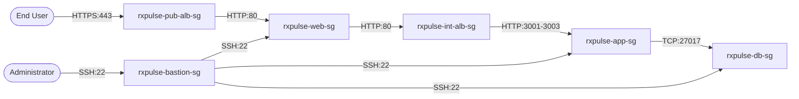

# RxPulse AWS EC2 Deployment Architecture — Security Flow

This document details the security design, flow control, and zero-trust policies applied to protect the **RxPulse** architecture on AWS.

---

## 1. Zero-Trust Security Groups Flow

Security Groups on AWS act as a stateful firewalls. We utilize **Security Group References** (SG-to-SG rules) instead of IP ranges. This ensures that even if an instance's private IP changes, access permissions remain restricted.



---

## 2. Inbound/Outbound Rules Architecture

### 2.1 Public ALB Security Group (`rxpulse-pub-alb-sg`)
- **Inbound Rules**:
  - Allow TCP `80` (HTTP) from `0.0.0.0/0` (Redirects to HTTPS)
  - Allow TCP `443` (HTTPS) from `0.0.0.0/0` (User client requests)
- **Outbound Rules**:
  - Allow TCP `80` to `rxpulse-web-sg`

### 2.2 Bastion Host Security Group (`rxpulse-bastion-sg`)
- **Inbound Rules**:
  - Allow TCP `22` (SSH) from `YOUR_IP/32` (Restricts administration to designated admin IP)
- **Outbound Rules**:
  - Allow TCP `22` to `rxpulse-web-sg`, `rxpulse-app-sg`, and `rxpulse-db-sg`

### 2.3 Frontend Web Security Group (`rxpulse-web-sg`)
- **Inbound Rules**:
  - Allow TCP `80` from `rxpulse-pub-alb-sg` (Requests from load balancer)
  - Allow TCP `22` from `rxpulse-bastion-sg` (Admin SSH sessions)
- **Outbound Rules**:
  - Allow TCP `80` to `rxpulse-int-alb-sg`
  - Allow HTTP/HTTPS out to Internet via NAT Gateway for npm builds and updates.

### 2.4 Internal ALB Security Group (`rxpulse-int-alb-sg`)
- **Inbound Rules**:
  - Allow TCP `80` from `rxpulse-web-sg` (NGINX proxy pass calls)
- **Outbound Rules**:
  - Allow TCP `3001` - `3003` to `rxpulse-app-sg`

### 2.5 Backend App Security Group (`rxpulse-app-sg`)
- **Inbound Rules**:
  - Allow TCP `3001`, `3002`, `3003` from `rxpulse-int-alb-sg` (Routed microservice requests)
  - Allow TCP `22` from `rxpulse-bastion-sg` (Admin SSH sessions)
- **Outbound Rules**:
  - Allow TCP `27017` to `rxpulse-db-sg`
  - Allow HTTP/HTTPS out to Internet via NAT Gateway for npm packages.

### 2.6 Database Security Group (`rxpulse-db-sg`)
- **Inbound Rules**:
  - Allow TCP `27017` from `rxpulse-app-sg` (Mongoose connection pools)
  - Allow TCP `22` from `rxpulse-bastion-sg` (Admin SSH sessions)
- **Outbound Rules**:
  - Allow HTTP/HTTPS out to Internet via NAT Gateway for MongoDB repository packages.

---

## 3. SSH Session Management via Bastion Host

To perform administrative tasks on instances in private subnets:

1. **SSH Key Pair**: Allocate an administrative SSH key.
2. **SSH Agent Forwarding**: Do NOT upload private keys to the Bastion host. Instead, use agent forwarding from your local administration computer:
   ```bash
   # Add key locally
   ssh-add /path/to/rxpulse-admin-key.pem
   
   # SSH to Bastion with Agent Forwarding enabled (-A)
   ssh -A ec2-user@<BASTION_PUBLIC_IP>
   ```
3. Once logged into Bastion, hop directly to private instances:
   ```bash
   ssh ec2-user@<PRIVATE_IP>
   ```
   *Your local SSH agent handles authentication signatures securely.*
